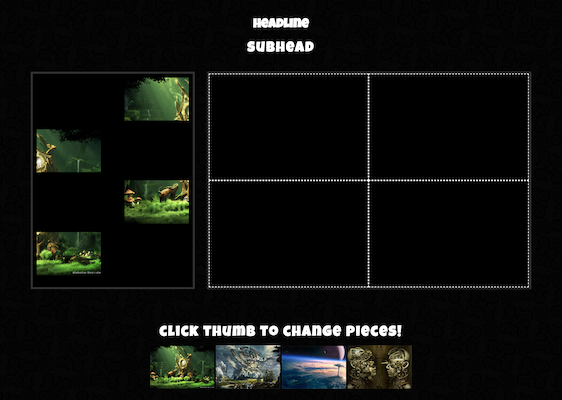

# Drag and Drop Puzzle Game

Puzzle game with draggable puzzle pieces. Player can drag puzzle pieces from the left to drop zones on the right to complete the puzzle. The thumbnails on the bottom of the page allows players to switch between different puzzles.

## Getting Started

### Prerequisites

Uses CSS3 and HTML5 but mainly focuses on Javascript.

### Installing

Clone or download the github link.

## Authors

* **Trevor Van Rys** - *Initial work* 
* **Daffodil Ho**

